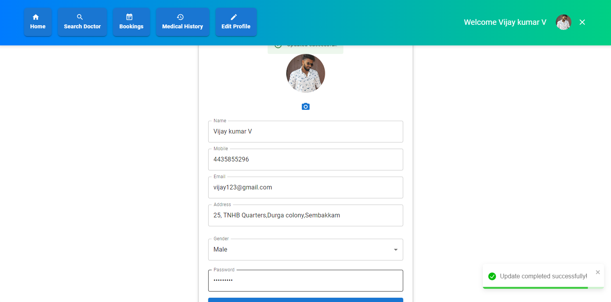
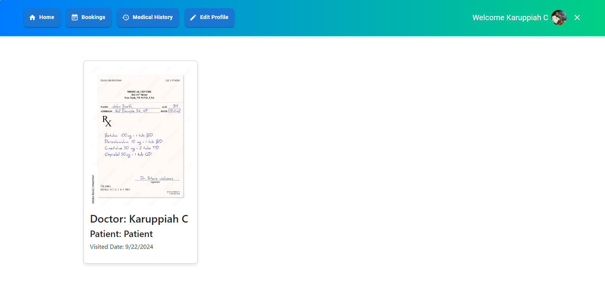
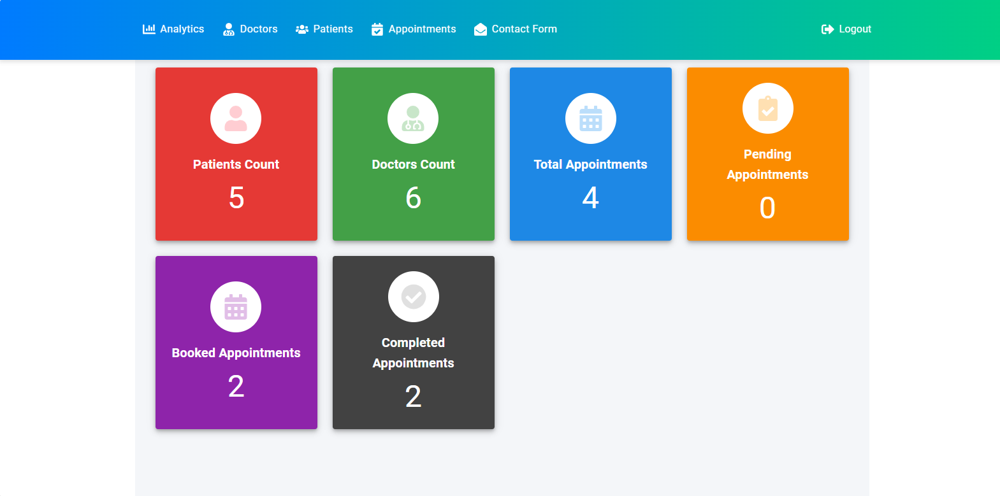
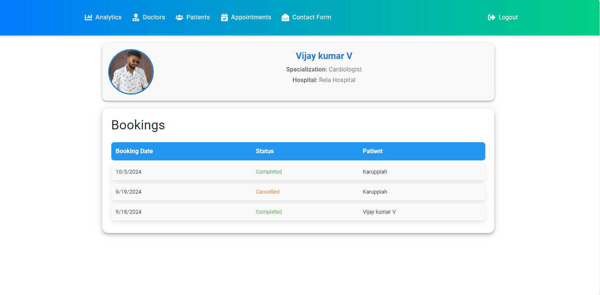
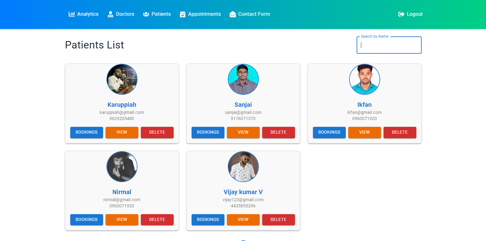
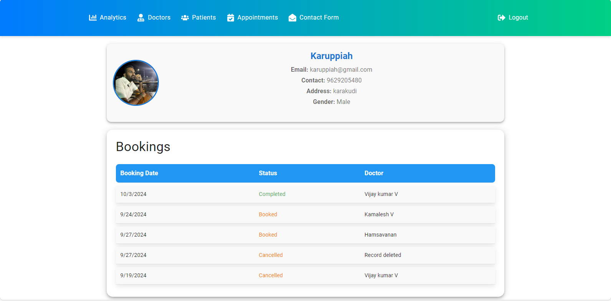
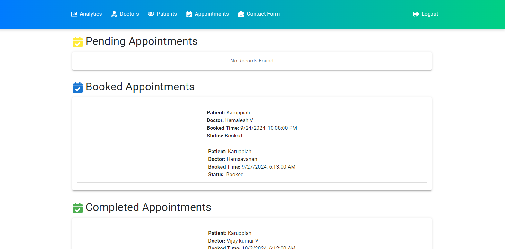
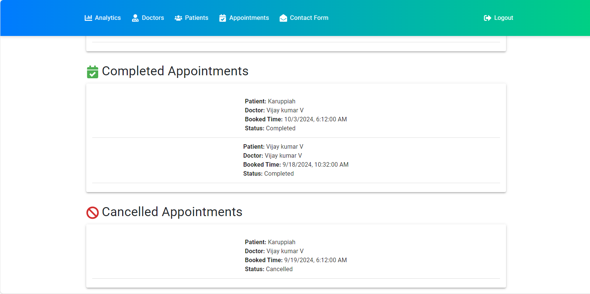

# Doctor Appointment System

## Project Overview
The **Doctor Appointment System** is a web-based application designed to simplify the process of booking and managing doctor appointments. It consists of three main modules:
1. **Patients**
2. **Doctors**
3. **Admin**

Each module provides a specific set of functionalities tailored to the role of the user, ensuring a smooth and efficient user experience.

---

## Modules

### 1. **Patients**
Patients can perform various actions within the system, such as:
- **Search Doctor**: Patients can search for doctors by:
  - Locality
  - Specialization

- **Book Appointment**: Patients can book an appointment with a selected doctor.

- **View Medical History**: Patients can view their medical history, including previous appointments and prescriptions.

- **Edit Profile**: Patients can update their profile information, such as contact details and personal information.

### 2. **Doctors**
Doctors have access to functionalities that help them manage their practice:
- **View Other Doctors**: Doctors can see a list of other doctors registered in the system.
- **Set Available Dates**: Doctors can manage and set their availability for patient appointments.
- **View and Manage Bookings**: Doctors can:
  - See their upcoming and past appointments.
  - Complete patient bookings.

- **Edit Profile**: Doctors can update their personal and professional information.

- **View Patient Medical History**: Doctors can access the medical history of patients who have booked an appointment with them.

- **Upload Prescription**: After a patient booking, doctors can upload a prescription to mark the appointment as completed.

### 3. **Admin**
The admin dashboard provides complete oversight of the system:
- **Analytics Dashboard**: A visual representation of key statistics, such as:
  - Total number of doctors and patients.
  - Appointment statistics (pending, booked, completed).

- **Doctors List**: Admins can view and manage all registered doctors.

- **Patients List**: Admins can view and manage all registered patients.

- **Manage Bookings**: Admins can view each doctor’s and patient’s bookings, and manage the status of bookings:
  - Pending
  - Booked
  - Completed
  - Cancelled

---

## Features Breakdown

### Patients Module
- Search for doctors by location and specialty.
- Book appointments directly from the list of available doctors.
- View and manage your own medical history.
- Edit your profile to update personal details.

### Doctors Module
- Access a directory of other doctors in the system.
- Set available dates for patient appointments.
- View and manage upcoming bookings.
- Edit your professional profile.
- Access patient medical history for better treatment.
- Upload prescriptions to complete bookings.

### Admin Module
- Comprehensive analytics dashboard to monitor system activity.
- Manage lists of doctors and patients.
- Oversee all appointments across the system.
- Update the status of appointments (cancelled, booked, completed).

---

## Conclusion
The **Doctor Appointment System** streamlines the appointment booking process for both patients and doctors, with a dedicated admin panel for management and analytics. It ensures ease of use while providing robust functionality for all users involved.
